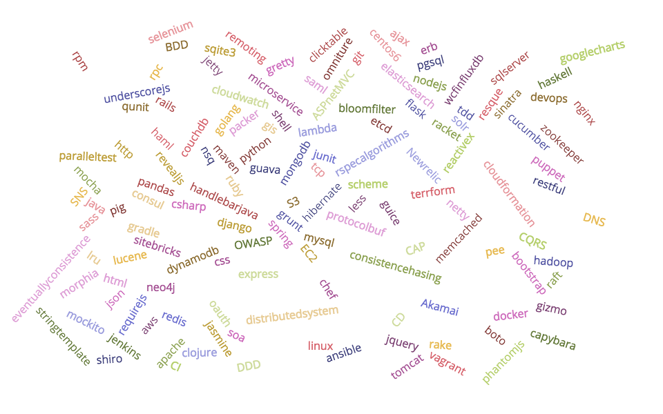

## 2016 校园招聘

---

## 关于我

 

* 何飞
* 2008年大学毕业
* 2011年加入ThoughtWorks

---

## 回到2011年

 

* 2.5年.NET作经验
* 一个安静的程序员
* 非常想提高自己的技术

---

### 文化与氛围
### 平台
### 成长

---

## 文化与氛围

 

* 开放与尊重
* 学习与分享
* 追求卓越与精益求精

---

## 平台

 

* 来自世界各地的优秀的同事
* 技术雷达，领先业界先进的技术
* 无限的可能

---

## 成长

 

* 挑战和压力
* 全面成长

---

## 现在的我

 

* Lead Consultant
* Tech Principal
* Architect
* Team Lead
* Speaker

---

## 技术栈

---

## 未来的我

---

## 谢谢
